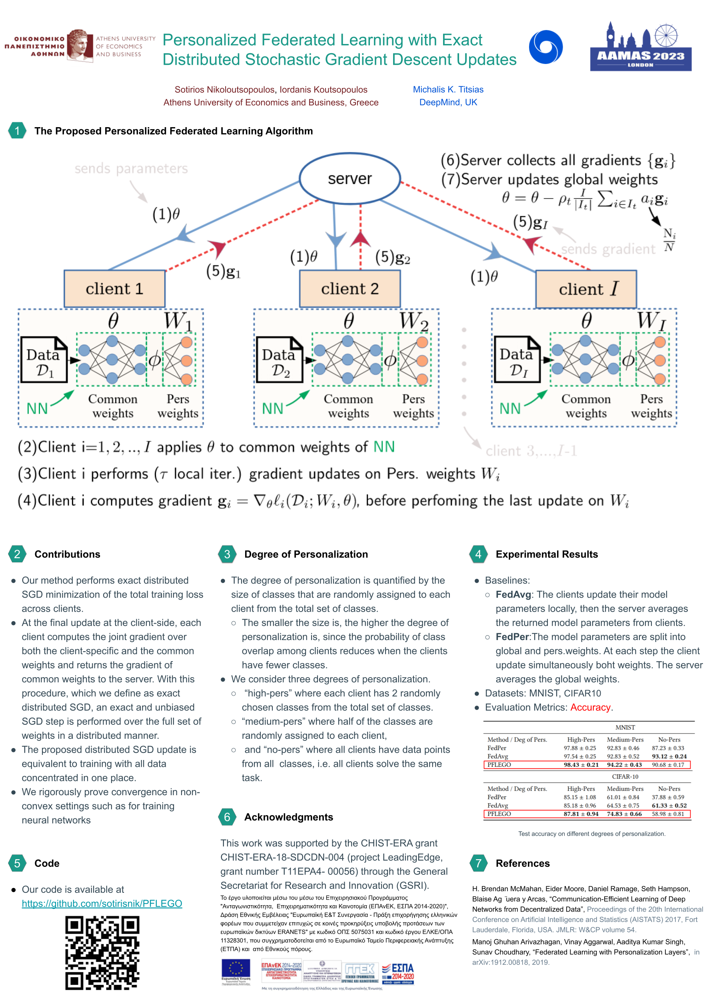

# Personalized Federated Learning with Exact Distributed Stochastic Gradient Descent Updates

Source code for paper "Personalized Federated Learning with Exact Distributed Stochastic Gradient Descent Updates" at ALA 2023 - Workshop at AAMAS 2023.

## Poster



## Requirements

- Ubuntu 18.04 (OS)
- Anaconda3

To install requirements, first download Anaconda3:

```setup
wget https://repo.anaconda.com/archive/Anaconda3-2020.11-Linux-x86_64.sh
chmod +x Anaconda3-2020.11-Linux-x86_64.sh
su root
cd ~/anaconda3/bin
./conda init bash
```

then run the following command to create the anaconda environment ( for cpu only, we will create a section for gpu when we upload the code to github):

```setup
conda env create -f mytf23.yml 
```

Create basic folders and place main.py into the exp folder:

```setup
mkdir exp out out/results
```

## Hardware Requirements
- We recommend a GPU with memory >= 11GB.

## Datasets
All datasets (MNIST,Fashion-MNIST,EMNIST,CIFAR-10,Omniglot) are downloaded automatically from our given code in main.py through the tensorflow_datasets library.


## Training

First we will explain the basic setup of the input arguments:
- inner_stepss (int): Number of local gradient updates at the client side
- rounds (int): Number of communication rounds
- dataset_name (str): Dataset to use e.x. cifar10, mnist, fashion_mnist, emnist, omniglot
- algo (str): Algorithm to use i.e fedavg, pflego, feper
- num_clients (int): Number of clients
- client_lr (float): Learning rate of client
- server_lr (float): Learning rate of server
- users_fraction (float): The fraction of users we sample at each round
- user_gpu (str): Add this argument only if you want to use a gpu, i.e. --use_gpu True
- scenario (str): RoundRobin partition i.e. highpers for high personalization, mediumpers for medium personalization, and nopers for no personalization
- optimizer (str): The optimizer of the server, i.e sgd or adam

Use these commands to run the code:

First, activate the environment
```train
source activate mytf23
```


For GPU,

PFLEGO with Omniglot

```train
python -u main.py  --dataset_name omniglot --inner_steps 50 --num_clients 50 --algo pflego --rounds 5000 --client_lr 0.007 --server_lr 0.003 --scenario highpers --use_gpu True
```

FedPer with CIFAR-10
```train
python -u main.py  --dataset_name mnist --inner_steps 50 --num_clients 100 --algo fedper --rounds 200 --client_lr 0.007 --server_lr 1.0 --scenario highpers --use_gpu True
```

For CPU,

FedAvg with Mnist
```train
python -u main.py  --dataset_name mnist --inner_steps 50 --num_clients 100 --algo fedavg --rounds 200 --client_lr 0.007 --server_lr 1.0 --scenario highpers
```

Note: At this moment we have designed Omniglot to run only when num_clients is set to 50. For the rest of the datasets you can change the num_clients hyperparameter freely.
